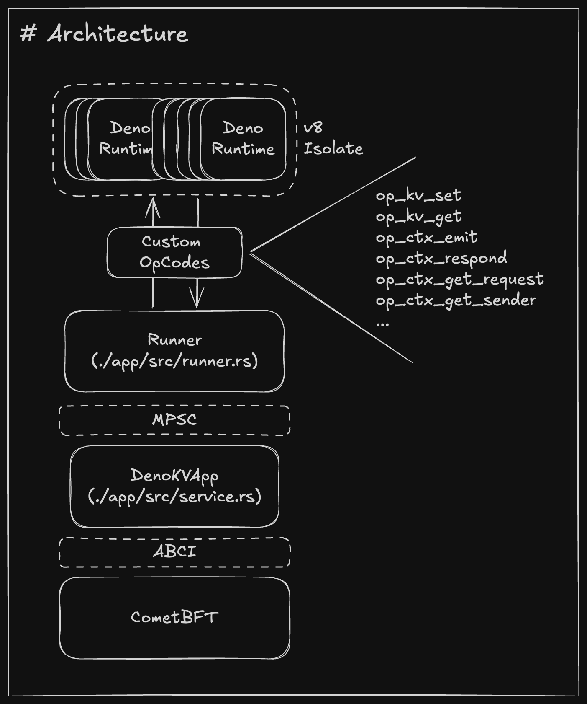

# Comet 🤝 Deno

## References

* https://github.com/informalsystems/tendermint-rs/blob/main/abci/src/application/kvstore.rs
* https://github.com/denoland/roll-your-own-javascript-runtime
* https://docs.cometbft.com/v0.38/guides/go

## How to run

1. Of course, clone this repo.
2. `make build`
3. `go run github.com/cometbft/cometbft/cmd/cometbft@v0.38.12 init --home ./.app`
4. (on the other terminal) `cd app && cargo run`
5. `./bin/kvstore`
